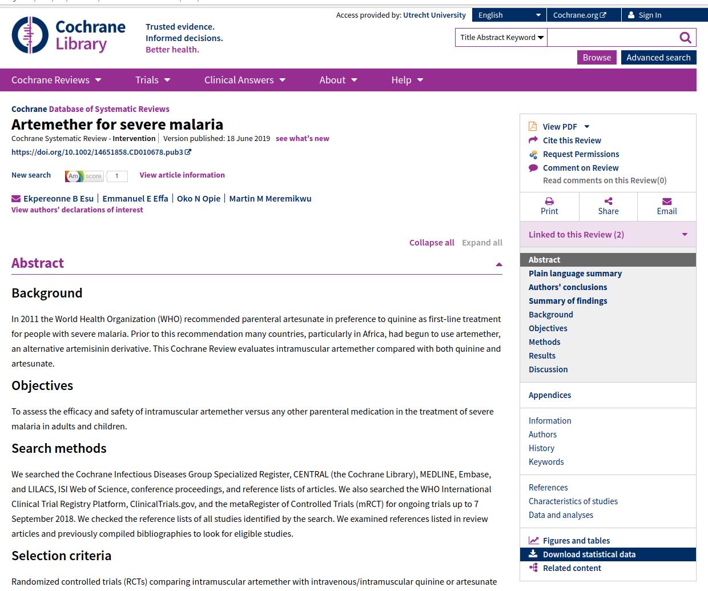
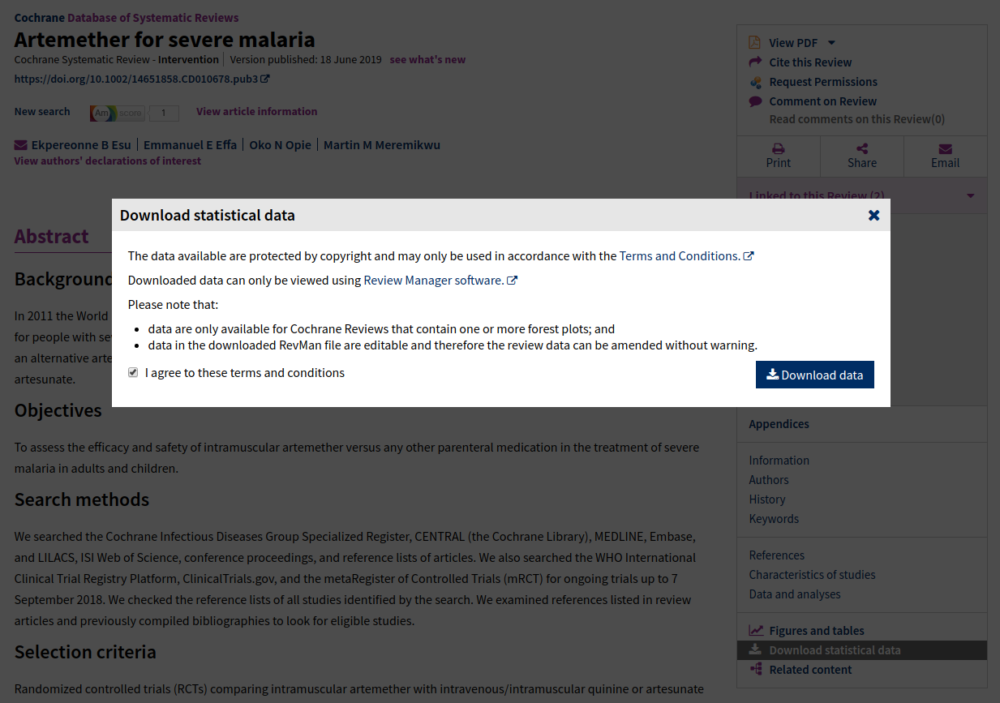

# cochrane2019

## Background

The Cochrane Database of Systematic Reviews ([CDSR](https://www.cochranelibrary.com/cdsr/reviews)) is the leading journal and database for systematic reviews in health care. CDSR includes Cochrane Systematic Reviews. Cochrane Reviews with one or more forest plots provide the raw data as an xml download (rm5 format).

This data is available for everyone - or for those with institutional access in case of restricted reviews - at the right side menu of each Cochrane Review page. An example is provided below:

Downloading the rm5 files requires ticking of a checkbox, as shown below.

## Data scraping

The dynamic loading behavior of the Cochrane pages prevent automatic downloading of rm5 files with previous developed web scrapers. The current scripts use a normal Google Chrome browser to get access to the rm5 files, but automate the procedure of scrawling to the Download section, clicking the proper button and enabling the checkbox.

A list of all Individual Cochrane Reviews have to be provided as input.
Files are downloaded in Google Chrome's default Download folder (i.e. ~/Downloads).

### Prerequisites

The scripts require:
* The [R](https://www.r-project.org/) statistical software with the package [rentrez](https://cran.r-project.org/web/packages/rentrez/index.html) installed - Used to download the doi urls for all CDSRs.
* The Javascript runtime [Node.js](https://nodejs.org/en/) with the package [puppeteer](https://github.com/GoogleChrome/puppeteer) installed.
* Google Chrome - Either use the standard installed version or the puppeteer binary.

## License

This project is licensed - see the [LICENSE](LICENSE) file for details

